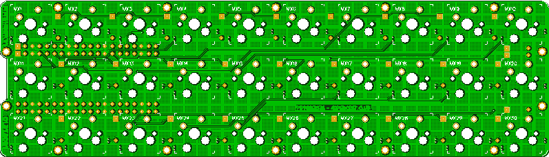

More info here:

http://www.40percent.club/2021/02/pipi-gherkin.html

[How to order PCBs from gerber files](http://www.40percent.club/2017/03/ordering-pcb.html)

EasyEDA ordering info:

PCB

Gerber: PiPi_Gherkin.zip
	
	Dimension: 55mm*192mm
	
	
Gerber files released under https://creativecommons.org/licenses/by-sa/4.0/

