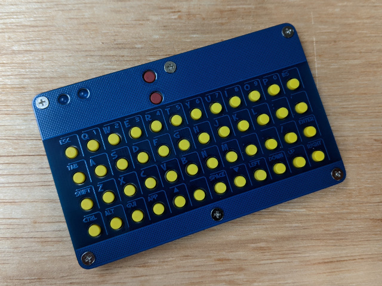
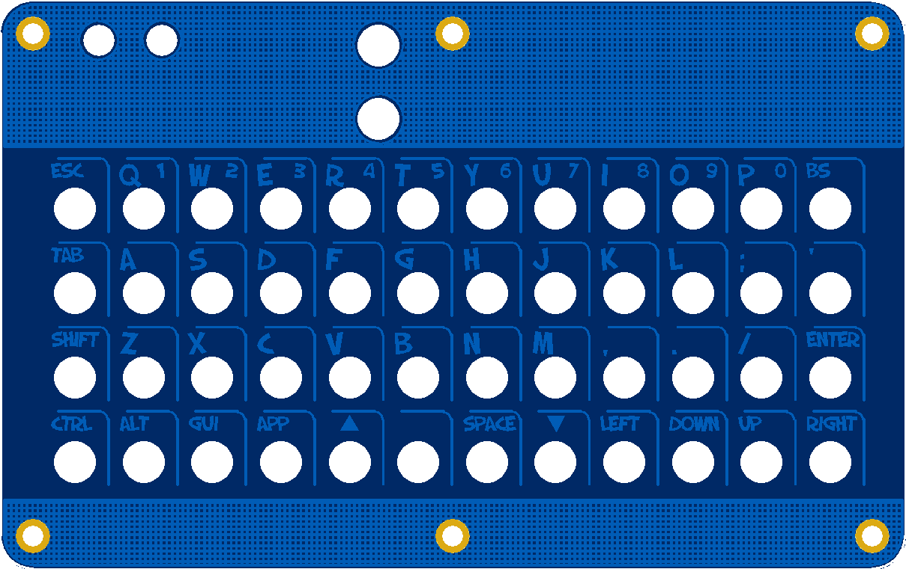
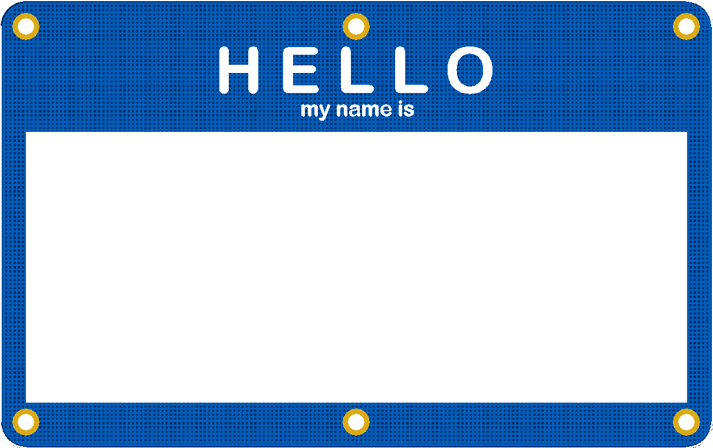
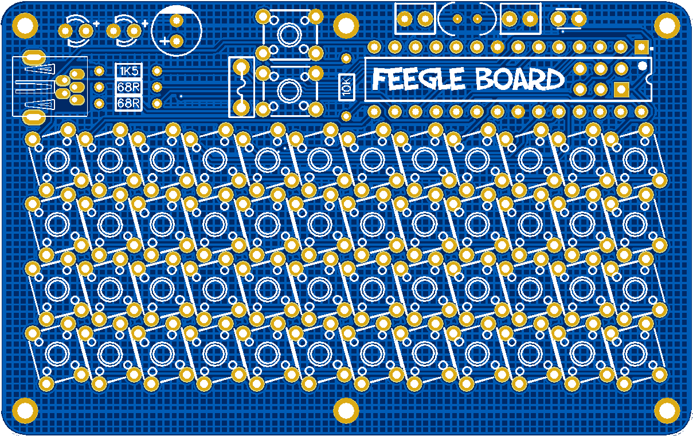

## Feegle Keyboard

More Information https://www.40percent.club/2020/10/feegle.html

======================
Feegle keyboard. 12x4 matrix.

TMK Firmware https://git.40percent.club/di0ib/tmk_keyboard/src/branch/master/keyboard/feegle

Bootloader same as Aardvark https://git.40percent.club/di0ib/Misc/src/branch/master/aardvark/bootloader

More info about V-USB https://www.40percent.club/2020/08/the-aardvark.html

Top

Gerber: Feegle_Top.zip

    PCB Thickness: 1mm

Bottom (other side is blank)

Gerber: Feegle_Bottom.zip

    PCB Thickness: 1mm

PCB

Gerber: Feegle_PCB.zip

    PCB Thickness: 1.6mm
    

Gerber files released under https://creativecommons.org/licenses/by-sa/4.0/

Pinout

    col: B0  B1  B2  C0  C1  C2  C3  C4  C5  D0  D1  B4
    row: D6  D5  D3  B3

BOM

    1	ATmega328p or ATmega328 28pin DIP
    1	16MHz subminiature crystal ECS-160-20-46X
    2	20pf capacitors 0.1" lead spacing, 4mm max height SR151A200JAR
    1	1uf capacitor 0.1" lead spacing, 4mm max height AR155C104K4R
    2	68ohm resistors. Smaller 1/8 or 1/10 watt
    1	1.5Kohm resistor. Smaller 1/8 or 1/10 watt
    2	6x6mm tactile switches 5mm height, for boot and reset
    48	6x6mm tactile switches 6-7mm height
    1	PTC Fuse RXEF010
    1	10uf capacitor 4mm diameter RNU1A100MDS1
    1	Mini USB connector with 2 mounting lugs. 2 lugs can be trimmed off 4 lug versions.
    2	T1 3mm Blue/White/Green/UV 3-3.3Vfd LEDs. Not all Green LEDs are 3V. Most Blue/White/UV are.
    6	4mm M2 brass spacers
    6	4mm M3 aluminum unthreaded spacers (optional) Harwin R30-6200414, Lyntron 6mm diameter AA5005-30-04.0-00
    6	3mm M2 screws for top
    6	5mm M2 screws for bottom
    6	Steel or Brass 0.3mm thick washers, 0.5mm red fiber washers, 1mm nylon washers
    1	ISP programmer for initial bootloader flashing.

[How to order your own PCBs](http://www.40percent.club/2017/03/ordering-pcb.html)
