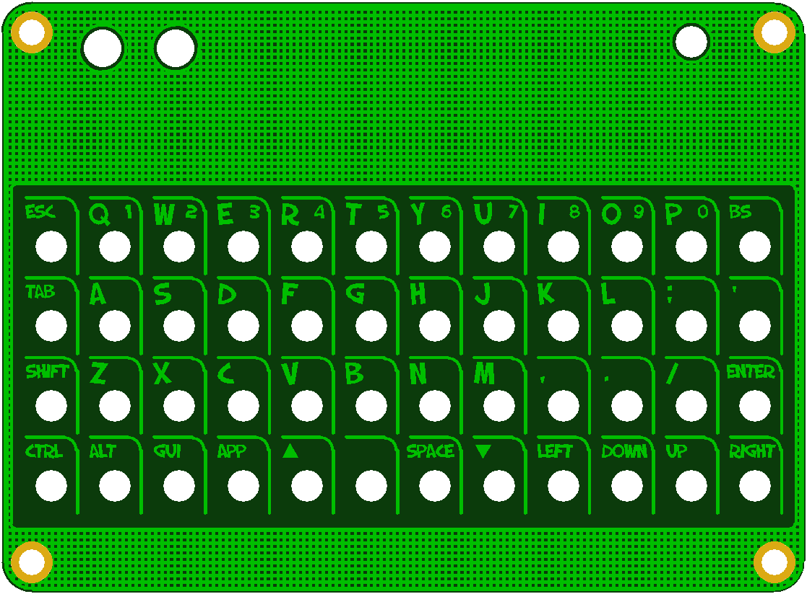
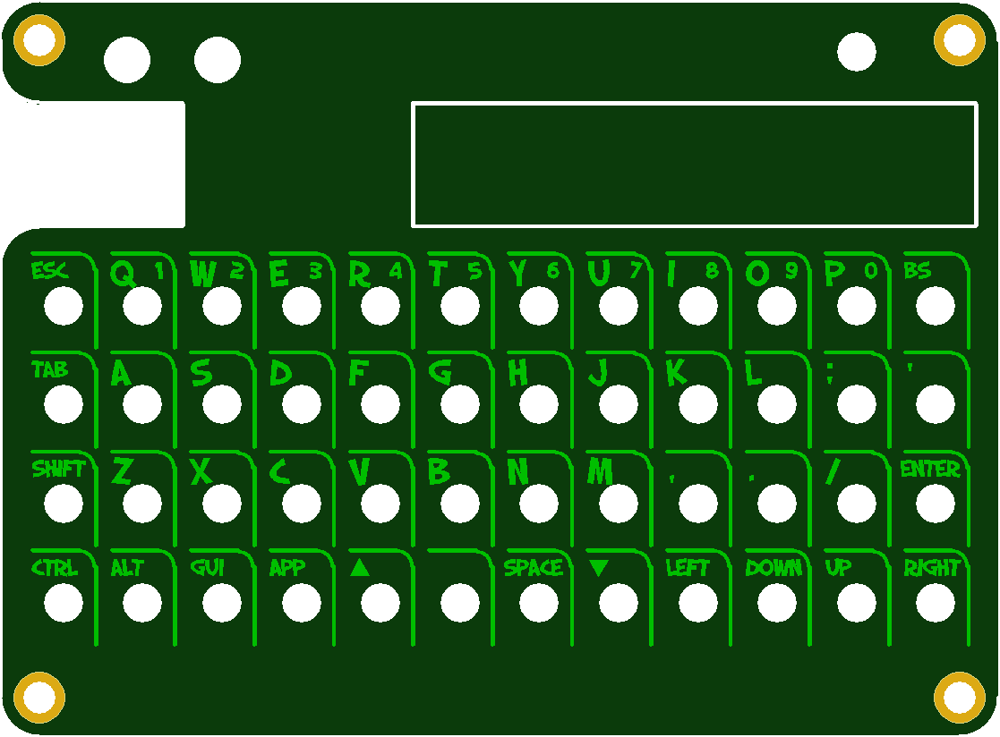
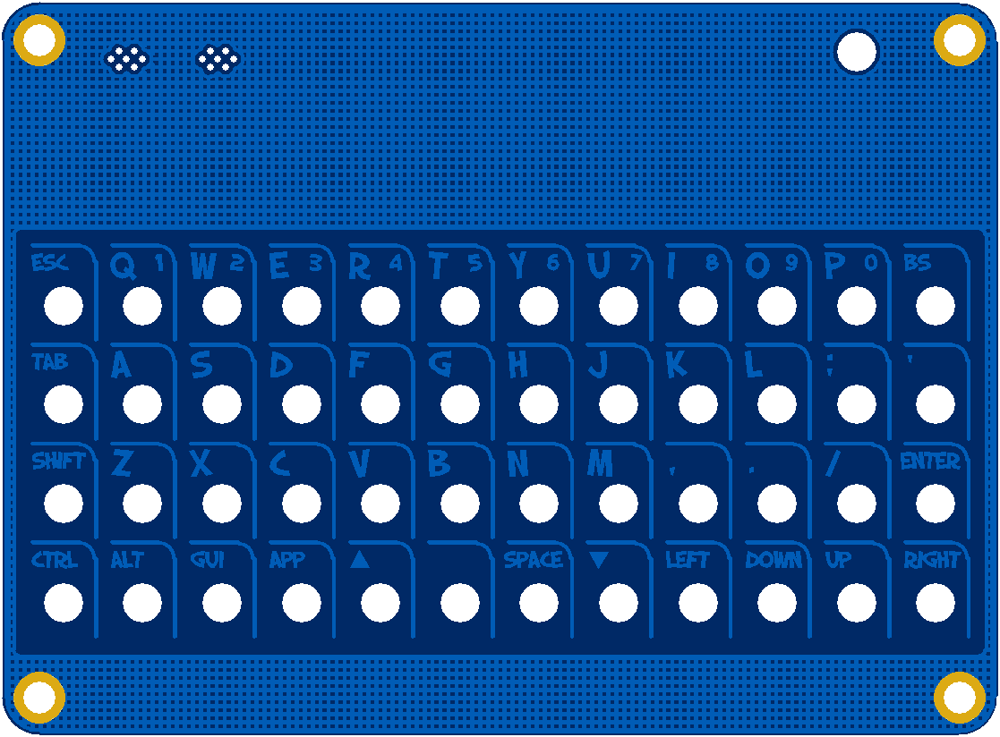
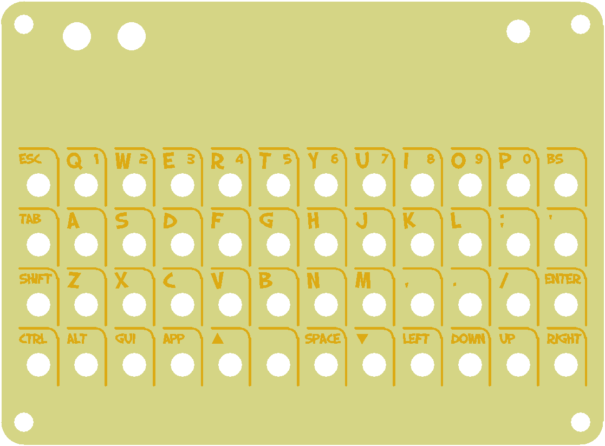
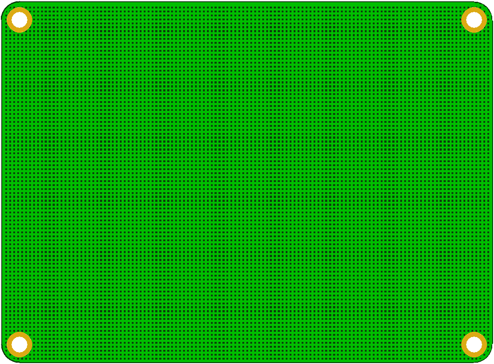
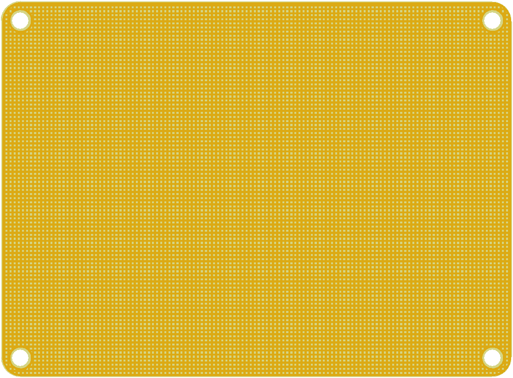
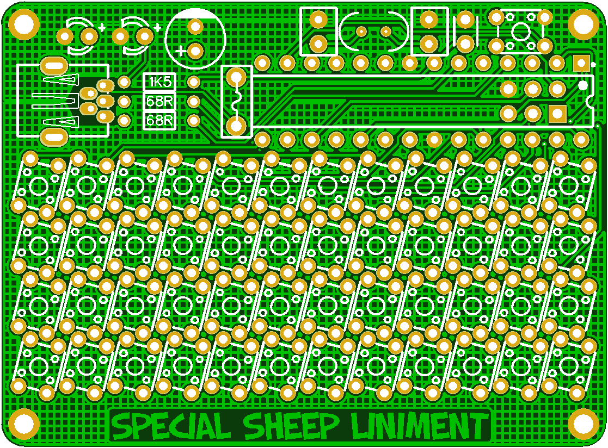
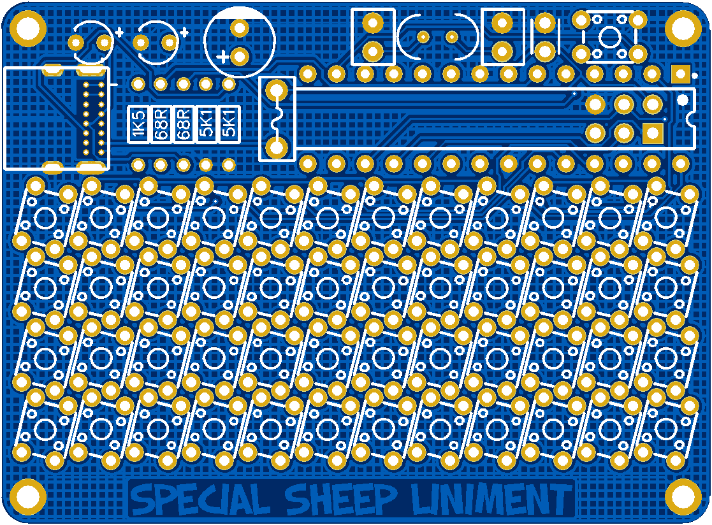
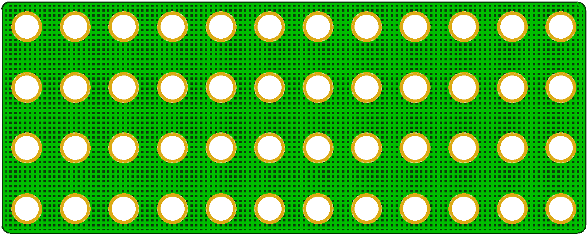

## Feegle XS Keyboard

More Information https://www.40percent.club/2020/11/feegle-xs.html

======================
Feegle XS keyboard. 12x4 matrix.

TMK Firmware https://git.40percent.club/di0ib/tmk_keyboard/src/branch/master/keyboard/feegle

Bootloader same as Aardvark https://git.40percent.club/di0ib/Misc/src/branch/master/aardvark/bootloader

More info about V-USB https://www.40percent.club/2020/08/the-aardvark.html

Top

Gerber: top.zip

    PCB Thickness: 1mm

Top Convertible

Gerber: top_convertible.zip

    PCB Thickness: 0.8mm

Top Grill

Gerber: top_grill.zip

    PCB Thickness: 1mm

Top Aluminum

Gerber: top_single.zip

    PCB Thickness: 1mm

Bottom

Gerber: bottom.zip

    PCB Thickness: 1mm

Bottom Aluminum

Gerber: bottom_single.zip

    PCB Thickness: 1mm

PCB mini USB

Gerber: feegle_xs.zip

    PCB Thickness: 1.2mm

PCB USB C

Gerber: feegle_xsc.zip

    PCB Thickness: 1.2mm

Spacer

Gerber: spacer.zip

    PCB Thickness: 0.8mm

Gerber files released under https://creativecommons.org/licenses/by-sa/4.0/

Pinout

    col: B0  B1  B2  C0  C1  C2  C3  C4  C5  D0  D1  B4
    row: D6  D5  D3  B3

BOM mini USB

    1	ATmega328p or ATmega328 28pin DIP
    48  4.5x4.5 6-7mm tall tactile switches
    1   4.5x4.5 5mm tall tactile switch (bootloader)
    1	16MHz subminiature crystal ECS-160-20-46X
    2	20pf capacitors 0.1" lead spacing, 4mm max height
    1	1uf capacitor 0.1" lead spacing, 4mm max height
    2	68ohm resistors. Smaller 1/8 or 1/10 watt
    1	1.5Kohm resistor. Smaller 1/8 or 1/10 watt
    1	PICO Fuse 0251.125MXL https://www.digikey.com/short/27hmbw0b
    1	10uf capacitor 4mm diameter RNU1A100MDS1
    1	Mini USB connector with 2 mounting lugs. 2 lugs can be trimmed off 4 lug versions.
    2	T1 3mm Blue/White/Green/UV 3-3.3Vfd LEDs. Not all Green LEDs are 3V. Most Blue/White/UV are.
    4	4mm M2 brass spacers
    4	4mm M3 aluminum unthreaded spacers R30-6200414 (optional)
    4	3mm M2 screws for top
    4	5mm M2 screws for bottom
    4	Steel or Brass 0.3mm thick washers
    1	ISP programmer for initial bootloader flashing.

BOM USB C, same as XS with the addition of the 5.1k resistors and the USB C connector instead of mini USB.

    1	ATmega328p or ATmega328 28pin DIP
    48  4.5x4.5 6-7mm tall tactile switches
    1   4.5x4.5 5mm tall tactile switch (bootloader)
    1	16MHz subminiature crystal ECS-160-20-46X
    2	20pf capacitors 0.1" lead spacing, 4mm max height
    1	1uf capacitor 0.1" lead spacing, 4mm max height
    2	68ohm resistors. Smaller 1/8 or 1/10 watt
    2   5.1Kohm resistor. Smaller 1/8 or 1/10 watt
    1	1.5Kohm resistor. Smaller 1/8 or 1/10 watt
    1	PICO Fuse 0251.125MXL https://www.digikey.com/short/27hmbw0b
    1	10uf capacitor 4mm diameter RNU1A100MDS1
    1	USB C connector CU3216SASBLR004-NH https://www.digikey.com/short/4mpbjd7j
    2	T1 3mm Blue/White/Green/UV 3-3.3Vfd LEDs. Not all Green LEDs are 3V. Most Blue/White/UV are.
    4	4mm M2 brass spacers
    4	4mm M3 aluminum unthreaded spacers R30-6200414 (optional)
    4	3mm M2 screws for top
    4	5mm M2 screws for bottom
    4	Steel or Brass 0.3mm thick washers
    1	ISP programmer for initial bootloader flashing.

Digikey - feegle xsc.xlsx

This list contains all the components from Digikey for the xsc. There is two different weight switches and an alternate USB C connector.

The only parts missing are the 4mm brass spacers and screws. These can be sources from Amazon or eBay.

[How to order your own PCBs](http://www.40percent.club/2017/03/ordering-pcb.html)
