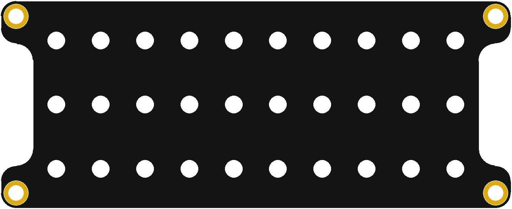
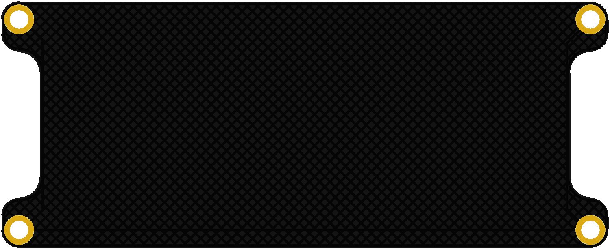
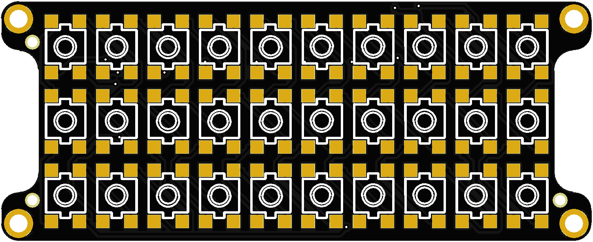

## mherkin Keyboard

More Information https://www.40percent.club/2021/10/mherkin.html

======================

mherkin (micro gherkin) keyboard. 10x3 matrix.

Top

Gerber: top.zip

    PCB Thickness: 0.8mm

Bottom

Gerber: bottom.zip

    PCB Thickness: 1mm

PCB

Gerber: mherkin.zip

    PCB Thickness: 1.6mm

Gerber files released under https://creativecommons.org/licenses/by-sa/4.0/

Pinout

    row: 12, 13, 14
    col: 2, 3, 4, 5, 6, 7, 8, 9, 10, 11

BOM: BOM_PCB_merkin.csv

Pick and Place: PickAndPlace_PCB_merkin_.csv

[How to order your own PCBs](http://www.40percent.club/2017/03/ordering-pcb.html)
