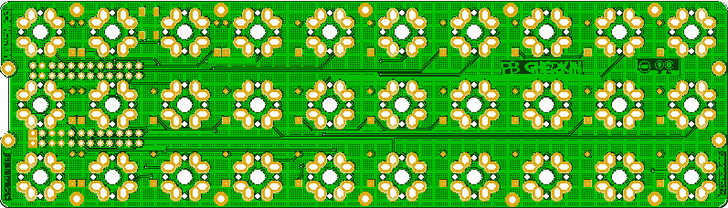
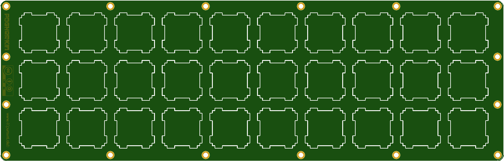
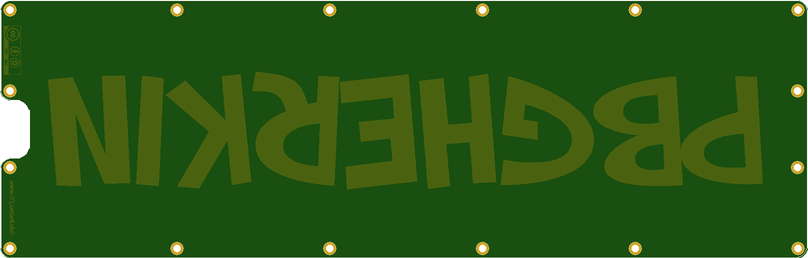

More info here:

https://www.40percent.club/2019/10/pb-gherkin.html

[How to order PCBs from gerber files](http://www.40percent.club/2017/03/ordering-pcb.html)

EasyEDA ordering info:

    191.7mm Max* 54.8mm Max;
    Layers: 2;
    PCB Thickness: 1.6mm;
    PCB Qty.: 5;
    PCB Color: Green;
    Surface Finish: HASL;
    Copper Weight: 1;
    Panelized PCBs: 1

Top and bottom plates. 

    201.2mm Max* 64.3mm Max;
    Layers: 2;
    PCB Thickness: 1.6mm;
    PCB Qty.: 5;
    PCB Color: Green;
    Surface Finish: HASL;
    Copper Weight: 1;
    Panelized PCBs: 1

Gerber files released under https://creativecommons.org/licenses/by-sa/4.0/

