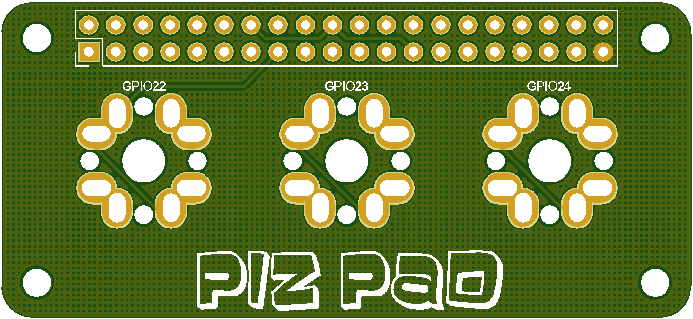

[How to order PCBs from gerber files](http://www.40percent.club/2017/03/ordering-pcb.html)

More information in blog:

EasyEDA ordering info:

    30mm Max* 65mm Max;
    Layers: 2;
    PCB Thickness: 1.6mm;
    PCB Qty.: 10;
    PCB Color: Blue;
    Surface Finish: HASL;
    Copper Weight: 1;
    Panelized PCBs: 1

Gerber files released under https://creativecommons.org/licenses/by-sa/4.0/

