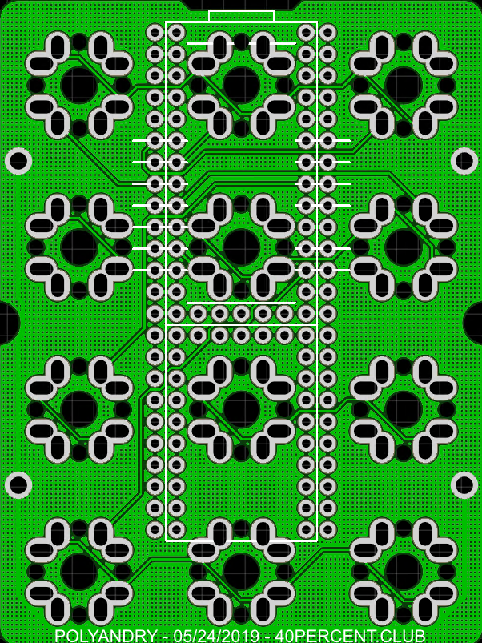
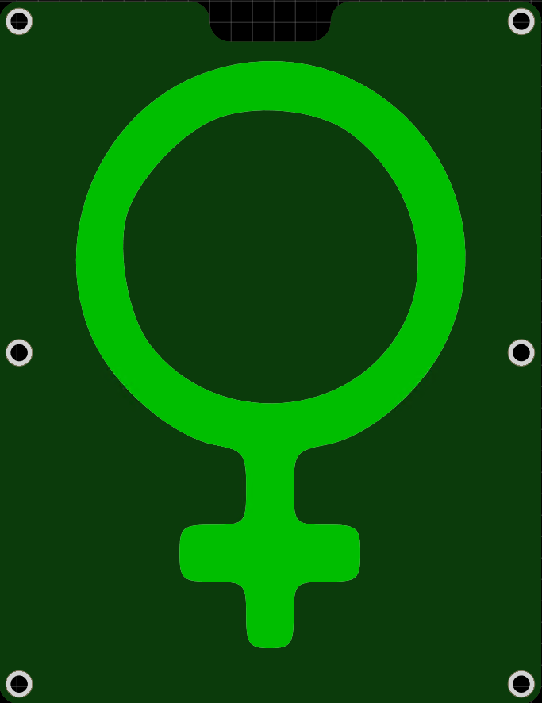
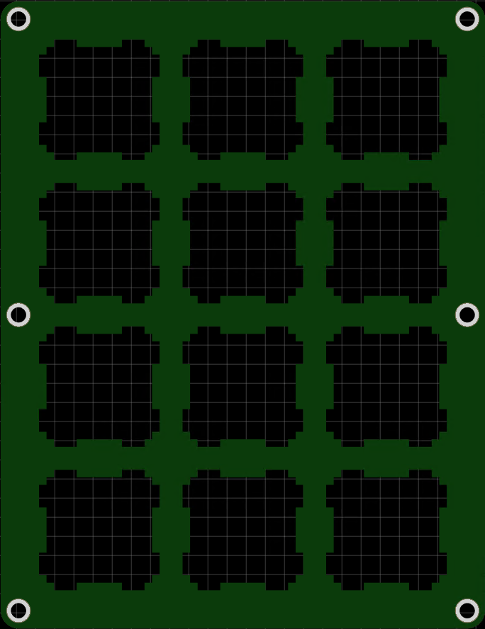

More info here:

http://www.40percent.club/2019/07/polyandry.html

[How to order PCBs from gerber files](http://www.40percent.club/2017/03/ordering-pcb.html)

EasyEDA ordering info:

PCB

Gerber: PolyPad.zip

    57mm Max* 76mm Max;
    Layers: 2;
    PCB Thickness: 1.6mm;
    PCB Qty.: 10;
    PCB Color: Green;
    Surface Finish: HASL;
    Copper Weight: 1;
    Panelized PCBs: 1

Bottom

Gerber: PolyPad_Bottom.zip

    64mm Max* 83mm Max;
    Layers: 2;
    PCB Thickness: 1.6mm;
    PCB Qty.: 10;
    PCB Color: Green;
    Surface Finish: HASL;
    Copper Weight: 1;
    Panelized PCBs: 1

Plate

Gerber: PolyPad_Top.zip

    64mm Max* 83mm Max;
    Layers: 2;
    PCB Thickness: 1.6mm;
    PCB Qty.: 10;
    PCB Color: Green;
    Surface Finish: HASL;
    Copper Weight: 1;
    Panelized PCBs: 1

	
	
Gerber files released under https://creativecommons.org/licenses/by-sa/4.0/

