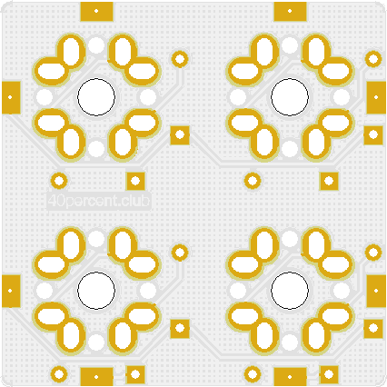
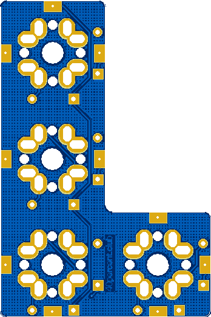
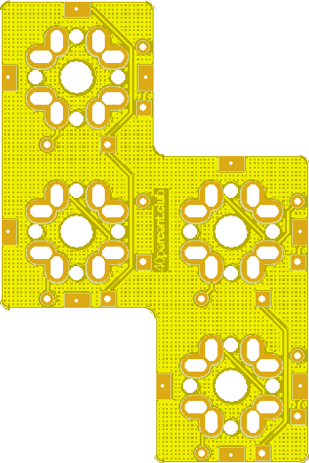
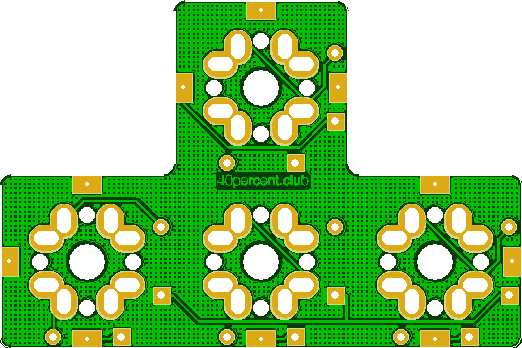

More info here:

http://www.40percent.club/2019/12/tetrominoes.html

[How to order PCBs from gerber files](http://www.40percent.club/2017/03/ordering-pcb.html)

EasyEDA ordering info:

Cube

Gerber: Gerber_Cube.zip

    38mm Max* 38mm Max;
    Layers: 2;
    PCB Thickness: 1.6mm;
    PCB Qty.: 10;
    PCB Color: Green;
    Surface Finish: HASL;
    Copper Weight: 1;
    Panelized PCBs: 1

L

Gerber: Gerber_L.zip

    57mm Max* 38mm Max;
    Layers: 2;
    PCB Thickness: 1.6mm;
    PCB Qty.: 10;
    PCB Color: Green;
    Surface Finish: HASL;
    Copper Weight: 1;
    Panelized PCBs: 1

S

Gerber: Gerber_S.zip

    57mm Max* 38mm Max;
    Layers: 2;
    PCB Thickness: 1.6mm;
    PCB Qty.: 10;
    PCB Color: Green;
    Surface Finish: HASL;
    Copper Weight: 1;
    Panelized PCBs: 1

T

Gerber: Gerber_T.zip

    38mm Max* 57mm Max;
    Layers: 2;
    PCB Thickness: 1.6mm;
    PCB Qty.: 10;
    PCB Color: Green;
    Surface Finish: HASL;
    Copper Weight: 1;
    Panelized PCBs: 1

Stick

Gerber: Gerber_Stick.zip

    76mm Max* 19mm Max;
    Layers: 2;
    PCB Thickness: 1.6mm;
    PCB Qty.: 10;
    PCB Color: Green;
    Surface Finish: HASL;
    Copper Weight: 1;
    Panelized PCBs: 1
	
	
Gerber files released under https://creativecommons.org/licenses/by-sa/4.0/

